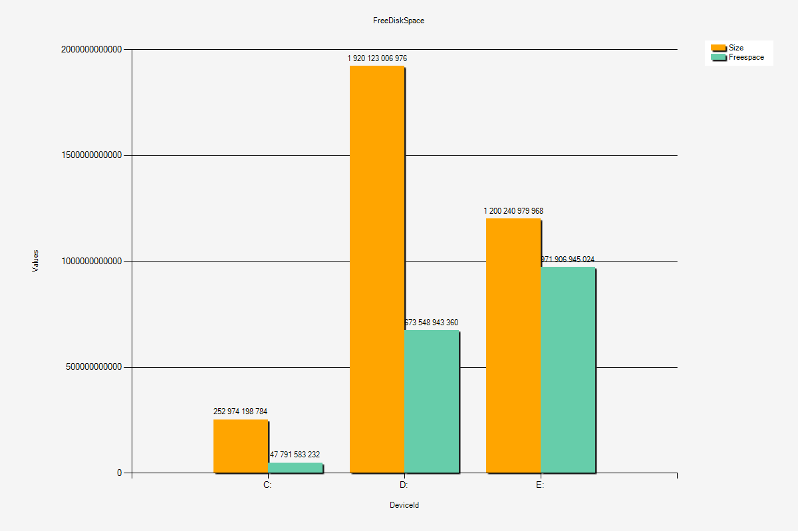

# PSChart

Very basic charting for PowerShell

## Usage

```powershell
Import-Module PSChart
$data = Get-CimInstance Win32_LogicalDisk | where DriveType -eq 3 
$data | out-chart -ChartType Column -Property DeviceId,Size,Freespace -Title 'FreeDiskSpace'`
     -SeriesColor Orange ,MediumAquamarine -ChartSettings @{LabelFormatString = 'N0'} 

```


